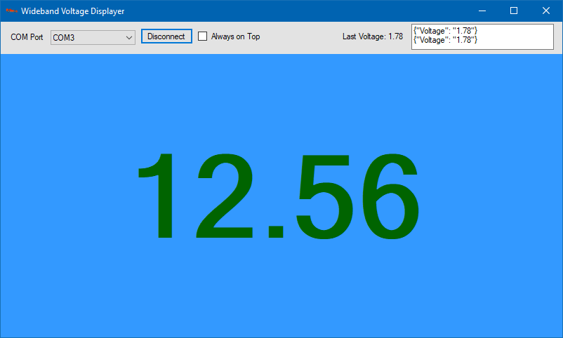

# Wideband Voltage Display

This project consists of an Arduino sketch that reads voltage in (0-5v) and communicates with a .NET WinForms app on a Windows PC to display a number that represents this value in the range of 9-19

From the Digital Wideband's documentation, it outputs a value:
> Analog 0-5V Linear Range is 9-19 AFR 0V = 9 AFR 5V = 19 AFR

See the [WB D1 Digital Wideband WBO Controller Module (Board)](https://www.wide-band.com/product-p/wb_d1diy.htm?fbclid=IwAR1HxyFk0bE6KYueTIFYDgQe6jiabUKki9khknbDLKLF-AkUgwS7NVnc5vw) for more information on this device.

# Goals

The serial output of the Wideband is too slow. Do the following:

-  Write Arduino sketch to read analog voltage
   -  Read voltage in 0-5v
   -  Report via Serial Port
-  Write a Windows App to show a voltage reading value
   -  Maps 0-5 to 9-19
   -  Option to "Stay On Top" always
   -  Select COM Port
   -  Connect/Disconnect COM Port
   -  Full Screen (voltage display) mode

# Requirements

-  Windows Application
   -  To run: Windows Operating System, .NET Framework 4.6
   -  To build/modify: Windows Operating System, Visual Studio 2017
-  Arduino Sketch
   -  Arduino Uno or compatible

# Steps To Build

-  Open .sln file in Visual Studio
-  "Build the solution"
-  The EXE (WidebandVoltageDisplay.exe) will be in /bin/Debug or /bin/Release (depending on your configuration) with all its other dependencies
   -  The other dependencies are needed for the EXE to run

# Author

Austin Brown [GitHub](https://github.com/luxdvie),  [austinbrown2500@gmail.com](mailto:austinbrown2500@gmail.com)